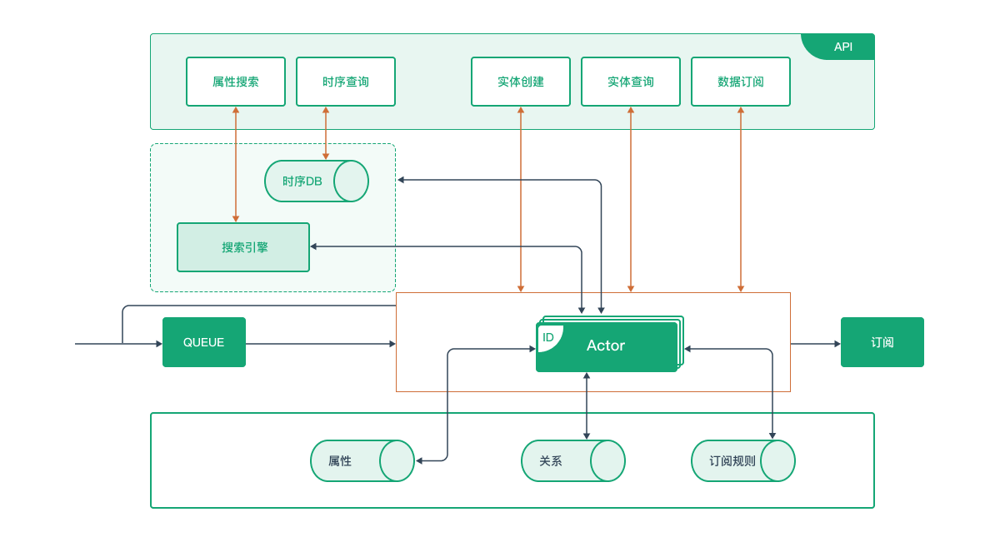
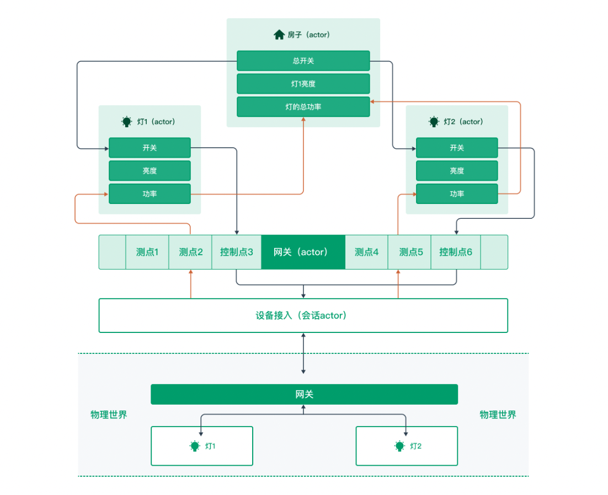
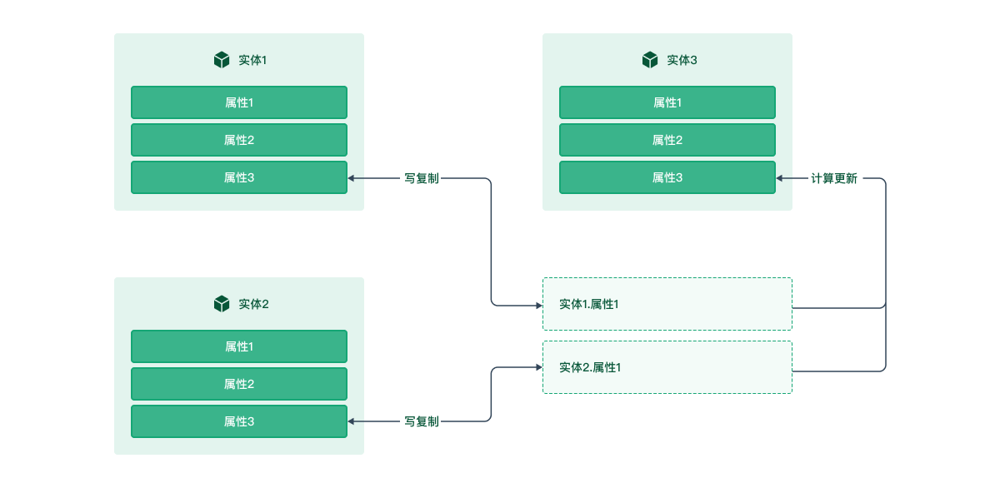

<h1 align="center"> tKeel-Core</h1>
<h5 align="center"> The digital engine of world</h5>
<div align="center">

[](https://goreportcard.com/report/github.com/tkeel-io/core)


[](http://godoc.org/github.com/tkeel-io/core)
[](https://codecov.io/gh/tkeel-io/core)
</div>

🌰 Core is the data centre of the tKeel IoT Open Platform, a high-performance, scalable and lightweight next-generation digital data engine.

The *entity* is the smallest unit of operation, providing read and write capabilities (attribute reading and writing, time series, subscriptions, mapping, etc.) through a simple API.

[中文](README_zh.md)

## 🚪 QuickStart

Core is an important base component of [tKeel](https://github.com/tkeel-io/tkeel), and it also has the ability to be deployed separately. Use the features of core to do great things, like those problems you're having trouble solving right now, and I think maybe core can help you.

### Requirement
🔧 Make sure you are well-prepared before using Core.
1. [Kubernetes](https://kubernetes.io/)
2. [Dapr with k8s](https://docs.dapr.io/getting-started/)


### Installation via tKeel
Core is the base component of tKeel and the API calls are made through the tKeel proxy. (See the [tKeel CLI installation documentation](https://tkeel-io.github.io/docs/cli ) for details)

### Independent Deployment
Clone this repo.
```bash 
git clone  git@github.com:tkeel-io/core.git
cd core
```
#### Self-hosted
> ⚠️ Note: Please run a redis process locally first, listening on port 6379, without password
##### Start your project with Dapr
```bash
dapr run --app-id core --app-protocol http --app-port 6789 --dapr-http-port 3500 --dapr-grpc-port 50001 --log-level debug  --components-path ./examples/configs/core  go run . serve
```
#### Kubernetes
1. Deploying the reids service
    ```bash
    helm install redis bitnami/redis
    ```
2. Running core programs
    ```bash
    kubectl apply -f k8s/core.yaml
    ```

## 🪜 Architecture
The architecture is divided into two planes, distinguished by operation.

- **Control Plane**：
  <br> entity creation, querying, etc. via HTTP.
- **Data Plane**：
  <br> Efficient reading, writing and subscribing to data is achieved through Dapr's pubsub.

<div align="center">



<i>Architecture </i>
</div>

## 🌱 Concepts
### Entity

An *entity* is an abstraction of Things in our IoT world, the smallest object that Core operates on. This includes smart lights, air conditioners, gateways, rooms, floors, even virtual devices generated through data aggregation, etc. We abstract these `Things` and define them as *Entity*.

*A Property* is a description of a part of information about an entity. An entity contains two types of property.
1. **Basic Property**: Properties that are required for every entity, such as `id`, `owner`, etc., to identify common characteristics of entities.
2. **Extended Property**: properties of an entity in addition to the base property that characterize a class or entity, such as the temperature of a **thermometer**.

For more design details please read [entity documentation](docs/entity/entity.md)

### Actor
[Actor](docs/actors/actor.md) is a runtime schema abstraction of an entity, used to maintain the real-time state of the entity and to provide some concrete behaviour for the provided entity.

### Relation
A relation is a link between entities.

### Mapper
[Mapper](docs/mapper/mapper.md) s an abstraction of entity property communication, enabling the upward transfer of data and the downward transfer of control commands.
<div align="center">



<i>Mapper Simulation</i>
</div>

The blue line represents the upward transfer and the black represents the downward transfer.

The *mapper* operation consists of two parts: `write copy` and `compute update`
<div align="center">


</div>

### Model

We define the set of constraints on an entity's properties as a model. An entity is a carrier of property data, but to parse and use the property data of an entity, we need descriptive information about the entity properties, such as type, range of values, etc. We call this descriptive information `constraints`. A model is a carrier containing a collection of `constraints`, and a model exists as an entity, [read the model documentation for more design details](docs/model/model.md).

### Subscription

Core provides easy and convenient [subscriptions](docs/subscription/subscription.md) for developers to access the data they care about in real time.

Used in the tKeel platform for the exchange of data between multiple plugins and within a plugin for all entity-based operations.

The underlying implementation logic is as follows: each plugin sends a request to Core when it registers, allowing core to automatically create an interactive `pubsub` with a uniform name of pluginID-pubsub,

The subscribed `topic`s are unified as pub-core, sub-core, and only core has permissions associated with the plugin
For example:
iothub: iothub-pubsub

**Subscription**  is available in three ways:
- **Real-time Subscription**: Subscriptions send real-time data about the entity to the subscriber.
- **Change Subscription**: The subscription sends entity property data to the subscriber when the subscriber's subscribed entity properties change and the change conditions are met.
- **Periodic Subscription**: Subscriptions periodically send entity property data to subscribers.

### Quick Start
Once we have deployed the Core application, we can call the API directly to implement the corresponding functionality, here is a well-written [Getting Started document](https://tkeel-io.github.io/docs/developer_cookbook/core/getting_started)

You can start experimenting with Core's features by referring to the demo in the documentation.


### How to use in tKeel
We have a [hello-core](https://github.com/tkeel-io/quickstarts/tree/main/hello-core), Example demo project, for illustration purposes we have used external traffic to access **tKeel**, and Python as the code for the example language.

You can refer to this project for a quick overview，A [tKeel Plugin](https://tkeel-io.github.io/docs/internal_concepts/plugin) how to use in tKeel

In this _[hello-core](https://github.com/tkeel-io/quickstarts/tree/main/hello-core)_ we show the generation of a `token` for use by MQTT，There are also functions such as **create entity**, **report properties**, **get snapshot**, **subscribe properties of entity**, etc.

### Entity Example
As the current Dapr SDK cannot handle the *header in HTTP requests*, the parameters are passed by way of *path* and *query*.
The functions in this [examples](examples/entity) , create entities, update entity properties via pubsub, query entities.

#### Create Entity
```go
    // Source: examples/entity/main.go
	client, err := dapr.NewClient()
	if nil != err {
		panic(err)
	}

	// create entity.
	createUrl := "plugins/pluginA/entities?id=test1&owner=abc&source=abc&type=device"

	result, err := client.InvokeMethodWithContent(context.Background(),
		"core",
		createUrl,
		"POST",
		&dapr.DataContent{
			ContentType: "application/json",
		})
	if nil != err {
		panic(err)
	}
	fmt.Println(string(result))
```
#### Update Entity Properties
```go
    // Source: examples/entity/main.go
    data := make(map[string]interface{})
	data["entity_id"] = "test1"
	data["owner"] = "abc"
	dataItem := make(map[string]interface{})
	dataItem["core"] = ValueType{Value: 189, Time: time.Now().UnixNano() / 1e6}
	data["data"] = dataItem

	err = client.PublishEvent(context.Background(),
		"client-pubsub",
		"core-pub",
		data,
	)

	if nil != err {
		panic(err)
	}
```

#### Get Entity Properties
```go
    // Source: examples/entity/main.go
    getUrl := "plugins/pluginA/entities/test1?owner=abc&source=abc&type=device"

	result, err = client.InvokeMethodWithContent(context.Background(),
		"core",
		getUrl,
		"GET",
		&dapr.DataContent{
			ContentType: "application/json",
		})
	if nil != err {
		panic(err)
	}
	fmt.Println(string(result))
```


## ⚙️ API
For more details on Core's functional API, please see the [ API documentation ](https://tkeel-io.github.io/docs/api/Core/tag ).

## 💬 Shall We Talk
If you have any suggestions or ideas, you are welcome to file an Issue at any time, we'll look forward to sharing them together to make the world a better place.

Thank you very much for your feedback and suggestions!

[Community Document](docs/development/README.md) will give you an idea of how you can start contributing to tKeel.

### 🙌 Contributing

[How to Develop](docs/development/developing-tkeel.md) explains how to configure your development environment.

We have this [Code of Conduct](docs/community/code-of-conduct.md) that we expect project participants to follow. Please read it in full so that you know what will and will not be tolerated.

### 🌟 Find Us
You may have many questions, and we will ensure that they are answered as soon as possible!

| Social Platforms | Links |
|:---|----|
|email| tkeel@yunify.com|
|Weibo| [@tkeel]()|


## 🏘️ Repos

| repo | Descriptions |
|:-----|:------------|
| [tKeel](https://github.com/tkeel-io/tkeel) | The code for the platform and an overview of the *IoT Open Platform* are included|
| [Core](https://github.com/tkeel-io/core) | tKeel's data centre |
| [CLI](https://github.com/tkeel-io/cli) | The tKeel CLI is the main tool for various tKeel-related tasks
| [Helm](https://github.com/tkeel-io/helm-charts) | Helm charts corresponding to tKeel |

