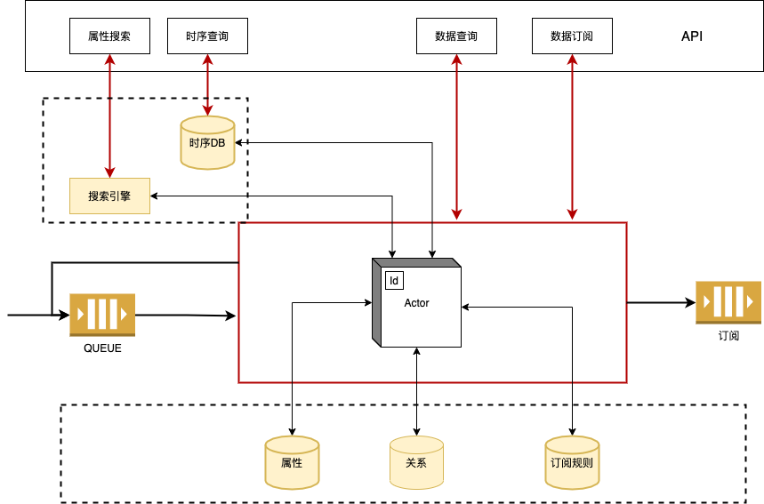
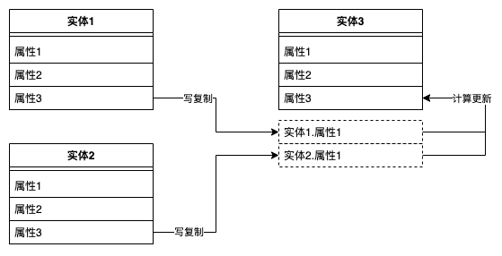
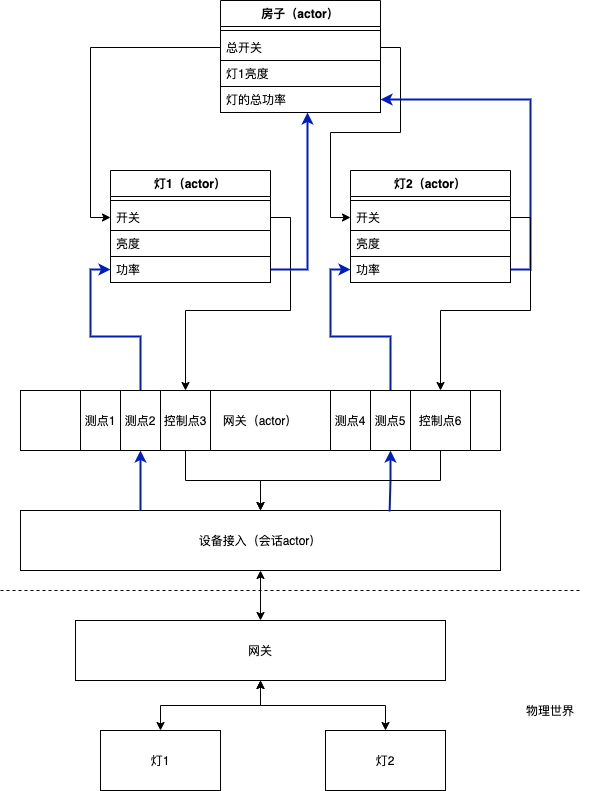
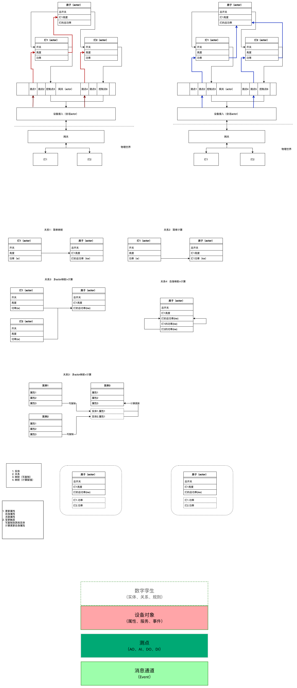
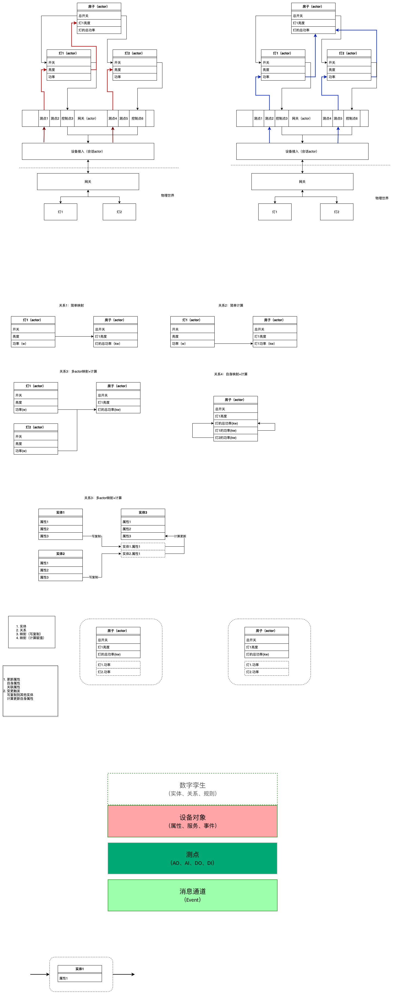
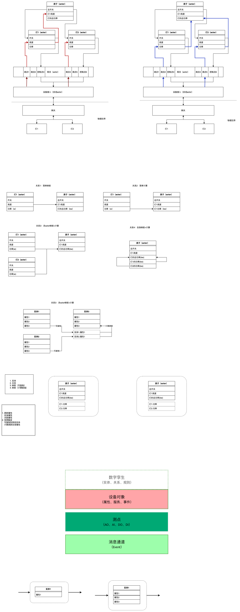

# Core
[English](README.md)



Core通过api对外提供属性搜索，时序查询，数据写入，数据查询，数据订阅等服务
    
## 实体
物联网世界里的操作对象，以及这些对象组合抽象出来的对象，包括网关，设备，设备的聚合抽象等等。  

实体具有属性，属性对一个实体某种信息的描述  

1. 内置属性
2. 映射属性
3. 自身属性

## actor
实体在程序中的存在形式，内存中存储了自己的属性，以及其他实体映射过来的属性

## 关系
关系是实体与实体之间的关系

## 映射
映射的操作包含两个部分: 写复制和计算更新

1. 简单映射
    ```sql
    select light1.a as house.a
    ``` 
2. 计算+映射
    ```sql
    select sum(light1.b, light2.b) as house.b
    ```
3. 多对一映射+计算
    ```sql
   	select sum(2*light1.a, light2.a) as house.e
    ```
4. 自身映射+计算
    ```sql
	select sum(light1.c, light1.d) as light1.e
    ```
### 映射（写复制）
自身属性的变更可能触发写复制到其他实体

### 映射（计算+更新）
其他实体映射过来的属性的变更，可能触发计算和更新自身属性

## 模型
模型用来约束实体的属性，可以有，也可以没有
有模型的属性需要按照模型的要求对属性的值进行处理，比如要进时序DB或者要用于搜索

## 订阅
订阅分为三种：
1. 实时订阅（收到消息就触发）
2. 变更订阅（属性有变更时触发）
3. 周期订阅（周期性上报所有属性）


每个plugin在注册的时候自动创建一个与core交互的pubsub, topic统一为pubcore，subcore，只有core与改plugin有相关权限
比如
pluginA: a-pubsub
pluginB: b-pubsub

### 长期订阅

订阅才有类sql语句表达，如何体现不同的订阅方式，待定

insert into pluginB select * from pluginA

insert into pluginB select A.a from pluginA

insert into pluginB select A.* from pluginB

订阅分为三步
1. 筛选数据
2. 数据计算和变换
3. 发送数据

对于订阅的实现，有两种方式待定
1. 和映射一样在实体内部进行
2. 作为一个独立的actor运行


### 临时订阅


## 规则引擎


## 数据的传递

 
 蓝色线条代表上行，黑色代表下行
 
## 三个层次的需求



### 消息通道



1. 作为消息通道，每个连接为一个实体，除内置属性外只有一个二进制的属性，没有关系，没有映射，需要支持订阅
2. 实体内置属性的变更
3. 二进制属性的解析为多个属性
4. 审计


实体 + 订阅

在第一层需求中，pluginB需要订阅pluginA的全部消息

insert into subB1 select * from pluginA

### 测点



pluginB 将pluginA发送的原始数据解析成属性后写入core，页面订阅某个实体的属性信息
pluginB需要订阅pluginB下实体A的属性信息

insert into subB2 select A.* from pluginA

### 设备对象

