## Actor

> `Actor` 是 [实体（Entity）](../entity/entity.md) 在运行时的模式抽象, 用于维护 `实体（Entity）` 的实时状态和提供`实体（Entity）`的具体行为。

> 下文中的 `消息` 和 `事件` 在此文中作同义。

> 为了避免歧义， `实体` 将采用英文 `entity` 表示。 

一个 `Actor` 指的是一个最基本的计算单元。 

它能接收一个消息并且基于其执行计算。在我们的设计中 `Actor` 由三部分组成：
- mailbox
- state
- coroutine

`mailbox` 是 Actor 的信箱，数据结构是一个简单的消息队列,用于接受外部输入；

`state` 是 Actor 自身状态描述；

`coroutine` 是 Actor 附着协程。

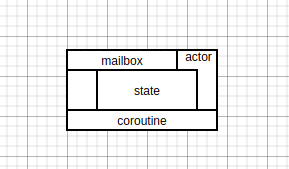

外部发送消息到 `mailbox`， `Actor` 从 `mailbox` 获取到消息并执行消息，然后更新自身状态。

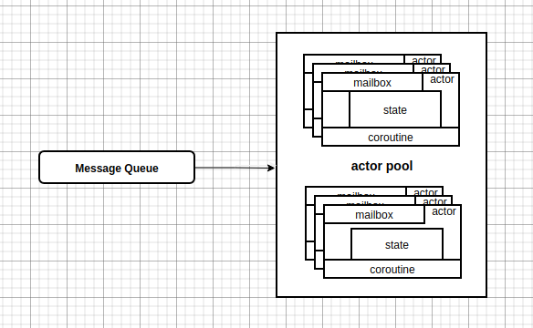

### 执行流程分析

1. `Actor` 被创建，初始化 `Actor`，同时运行 `Actor` 内 `coroutine`。
2. 外部消息异步发送到 `Actor` 的 `mailbox`，`mailbox` 接受到消息触发 `Actor` 唤醒内部对应的 `coroutine`。
3. 唤醒的 `coroutine` 消费 `mailbox`，执行计算并更新自身`状态（state）`。
4. `coroutine` 消费完 `mailbox` 内所有消息后进入阻塞状态等待唤醒。
5. 重复 2-4 过程。

## Reactor

> Don't call us, we'll call you. 

> Reactor 模式是一种典型的事件驱动的编程模型。
> Reactor 逆置了程序处理的流程。事件驱动模型是一个状态机，包含了状态(state), 输入事件(input-event), 状态转移(transition), 状态转移即状态到输入事件的一组映射。

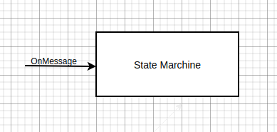
`State Marchine` 通过注册的回调来接受消息并更新自身状态。

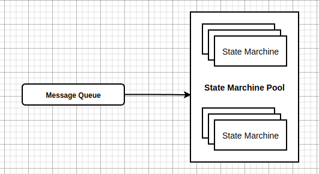

### 执行流程分析

1. 创建并初始化状态机。
2. `State Marchine Pool` 从 `Message Queue` 消费到一条事件。
3. 根据事件拿到事件对应的 `State Marchine` 的上下文。
4. 以事件为输入执行 `State Marchine` 注册的回调， 完成 `State Marchine` 的状态更新。
5. 重复执行 2-4 过程。

## Actor & Reactor
1. 每个 `Actor` 都有自己的 `mailbox`，所以消息的处理不会直接在 `Queue` 处阻塞，大大的提高高消息的并发处理性能。
2. 每个 `Actor` 都拥有一个自己的 `coroutine`，但是在 *IoT* 场景下各个 `Actor` 的消息频率是不同的，部分 `Actor` 会过载，部分 `Actor` 会非常活跃，而部分 `Actor` 不会活跃，因为负载不同会导致：

    - *操作系统* 对 `Actor` 的工作负载是无感知的。所以对每一个 `Actor` 中的 `coroutine` 调度是没有区别的，这样会导致许多的无效调度，`coroutine` 负载不均衡，空耗 `CPU` 资源。
    - 不活跃的 `Actor` 可能导致 `Actor` 在分布式系统中频繁的调度。
3. reactor 使用 `coroutine pool` 配合 `State Machine` 的模式实现，`pool` 可以使得 `coroutine` 的调度是 <u>有效的且均衡的</u>，提高 `coroutine` 在 `CPU` 时间片的使用效率。
4. reactor 消费从 `Queue` 消费消息，并使用 `coroutine pool` 实现并发计算（concurrency），可能存在多个 `coroutine` 阻塞在同一个 `State Machine`上，从而降低 `coroutine` 的使用效率。
5. reactor 使用 `coroutine pool` 来顺序消费 `Queue`，相对而言其并发处理效率较之 `Actor` 更低。
5. reactor 模式下消息出 `Queue` 之后，事件被回调函数执行是乱序的。

## 流数据处理分析
`Message Queue` 的消费是顺序的，我们想要并发处理这些消息，就需要虚拟一个 `Window` 来标记 `处理中` 的消息。 这个窗口的大小和并发性挂钩。
在上面的讨论到的`Actor`模式中 *Window-Size* 是所有 `mailbox` 的数量和。在 `Reactor` 模式中 `Window-Size` 是 `coroutine` 的数量。

## Entity Runtime
设计目标：
- 高并发
- 消息可靠，对于消息丢失有尽量小的容忍度。
- `coroutine` 负载均衡。

为了获得更好的 _并发性_ 和 _协程负载均衡_，我们结合 `Actor` 和 `Reactor` 对 Entity 运行时做出如下定义：

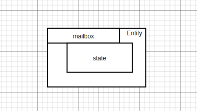

在此定义中，为 `mailbox` 获得更好的并发性，去掉固定的 `coroutine`, 以 `coroutine pool` 实现 `coroutine` 的动态分配，规避负载不均衡。

#### 消息处理模块概览：
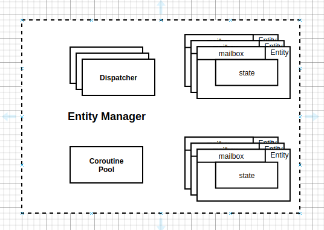
上图中组成部分有：`Entity Manager`，`Dispatcher`,`Coroutine Pool`, `Entity`。

- **Entity**：`Entity`存在两种状态， `attatched`, `detatched`，当coroutine与Entity结合的时候Entity为attached状态，当coroutine与Entity分离的时候Entity为detached状态，简单看来Entity可以在`actor`和`state marchine`之间切换。
- **Entity Manager**：`Entity Manager`是管理一个服务实例内的所有的Entity。
- **Dispatcher**： `Dispatcher`是从`Message Queue`的`mailbox`之间的一个消息分发器。
- **Coroutine Pool**: `Coroutine Pool`是`Coroutine`的管理器，主要提供`Coroutine`上任务的负载均衡。
  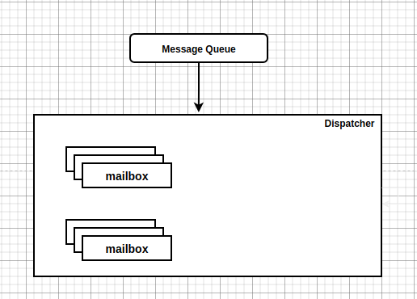

#### Entity Attach
Entity Attach 流程图如下：
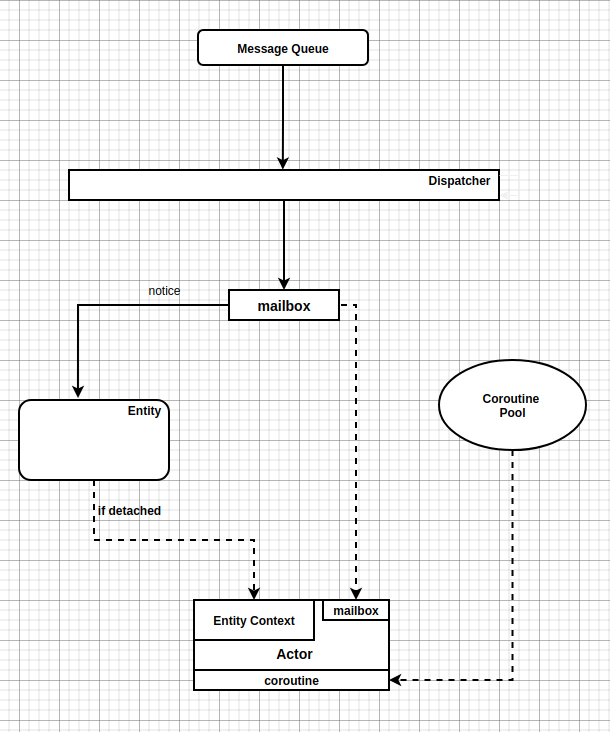

## Entity 数据落盘

`Entity` 数据落盘的时候需要针对不同的数据来进行存储的，可以分为`时序`，`属性`。

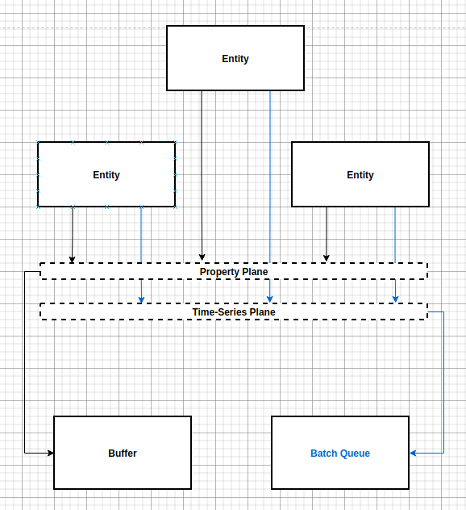

### 属性数据落盘

- 对于属性数据的落盘，我们对属性实现一个变更数据 `Buffer`，当 `Buffer` 满溢我们对窗口内的所有属性进行存储，此外我们也采用定时落盘策略，定时对 `Buffer` 进行落盘，以保证属性的存储一致性和实时性。

### 时序数据落盘

- 对于时序数据的落盘，我们对时序实现一个变更数据的 `Batch Queue`，当 `Batch Queue` 满溢是我们对时序数据进行存储，此外我们也采用定时刷盘策略，定时对 `Batch Queue` 刷盘，以保证时序数据存储的一致性和实时性。

## Entity 数据查询

> 数据查询我们从三个需求角度切入：属性查询，时序查询，实体查询。

### 属性查询

属性数据查询从两个角度查询：最新属性查询，属性数据库查询。
最新属性数据查询直接从 `Actor` 查询数据，属性数据库查询从属性存储的数据库查询数据。

### 时序查询

时序数据查询从两个家督查询：最新时序查询，时序数据数据库查询。
最新时序数据查询直接从 `Actor` 查询最新的数据，时序数据库查询从存储时序数据库查询数据。

### 实体查询

实体查询直接从 `Actor` 查询实体的完整数据。

## 属性数据的顺序性

对于包含时序数据的系统而言，我们对于时序数据的顺序性一定是需要得到保证的，但是顺序性和并发性是存在性能取舍的。

对于时序数据对实体的更新顺序，存在以下可能：

1. 消息流中的事件消息处理和`映射`数据传递乱序。

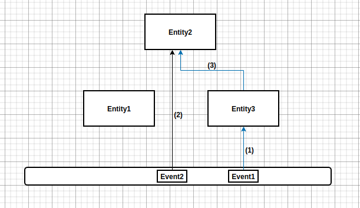

2. 消息流中的事件消息处理和`映射`数据传递没有乱序。

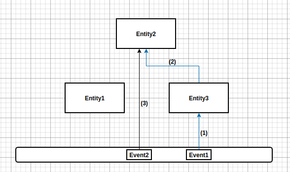

## 关系和映射

`关系`和`映射`的逻辑，我觉得可以使用两个逻辑层面来表达这两种东西。

**实体与实体之间的关系：**

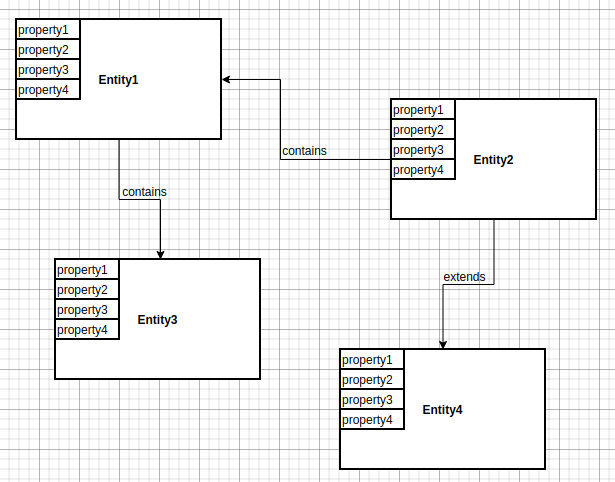

**实体与实体之间的数据映射：**

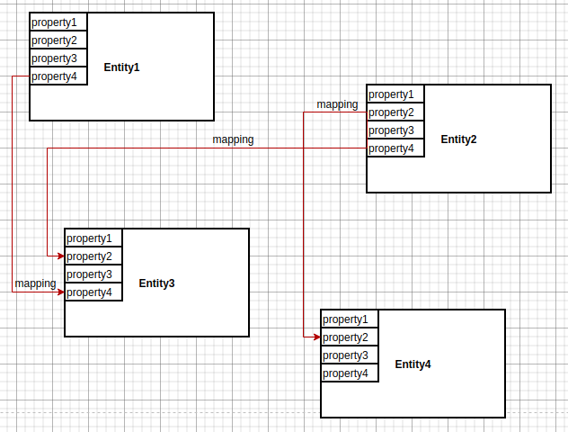

**实体关系和实体数据映射：**

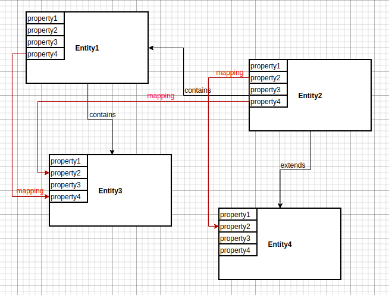

## Issues

1. 一个dispatcher对应于一个Topic吗？
    - 不应该是这样，试想一下，数据映射中写同步的Topic应该是哪一个，毫无疑问应该是`core-pubsub`。
2. 对于时序消息处理的有序性，我们仅仅保证实体自身时序消息的有序行，不保证`实体自身变更`和`实体间的变更传递和自身变更`的有序性。

## References

