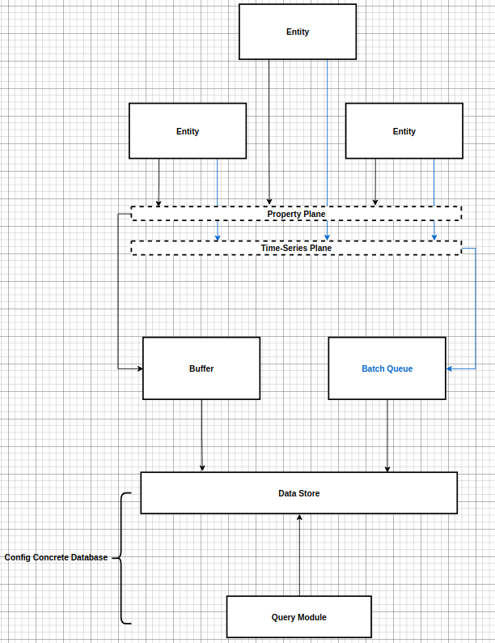

## Time Series Store 

其实对于core而言，我们提供对实体数据的存储和查询，之于其存储形式和查询方式，完全是可配置的。

存储模块的配置决定落盘的细节和数据查询的细节。

> 这里有一个细节，那就是各种存储配置对时序存储的支持是不同的，我们可以如`prometheus`支持`double`类型数据，`clickhouse`支持更多类型，等等。

## 列数据库和时序数据库

1. 时序数据库大多数仅仅支持`Number`类型的数据，而`列数据库`支持更多。
2. 时序数据库可以支持很强大的时需分析。
3. 现在市场上的时序数据库对分布式支持不好(可以自己备份缓解)。
4. 在分布式系统中很难得到时序保证。

1. 采集时间
2. 处理时间
3. 存储时间

好在在我们的设计中，对于实体而言数据是时序的，但在宏观层面数据是无序的，但是无妨，符合tag,label系统。

