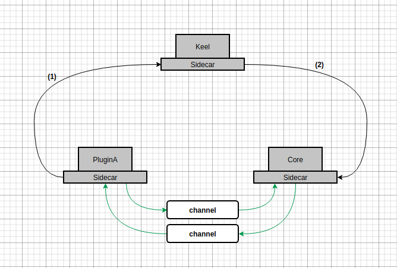

## channel

在物联网场景下，我们往往需要面对高并发，高吞吐量的压力，为了规避因为边车和网关带来的额外的路由开销，我们设计 `channel`, `channel` 的一端连接 core，一端连接 tKeel 平台的其他插件， 以适应物联网场景下的高并发高吞吐量挑战。

上图中有三个服务，`Keel` 是 `tKeel` 平台的网关，代理所有插件的请求，`PluginA` 是一个 `tKeel` 平台的插件， PluginA 想要向 Core发送请求， 按照常规调用链路，应该是图中的黑色连线，请求经过 Keel 转发到 Core， 对于常规的请求（如实体创建，订阅创建，映射删除），这些低频且不考虑实时性的请求是可以的，但是对于高频的设备消息请求，一方面会增加额外的网络链路开销，另一方面高频的数据流也会增加 Keel 服务节点的压力。

上图中绿色的连线是表示通过 channel 传输请求的链路。

### channels

对于 `channel`, 我们的定义的仅仅是数据传输的通道，在实现时根据具体场景可以是多样的。

我们可以将 channel实现为：

- TCP 连接
- MQ
- RPC
- GRPC

### 插件通过 channel 实现对 core 的异步调用

在core内部存在一个插件的实体，插件实体内有很多属性，属性名称就是插件调用的方法，这些方法执行后的返回值就存在插件实体内。

