#### 1  时序图
##### 1.1 Search Service
1. Search

2. DeleteByID
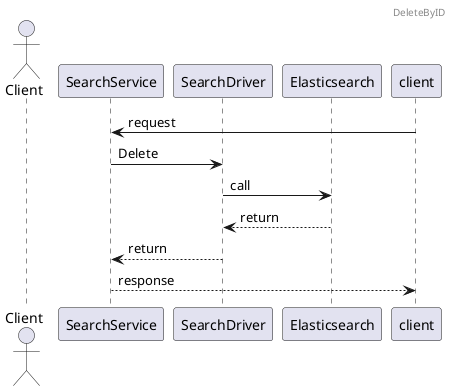
3. Index
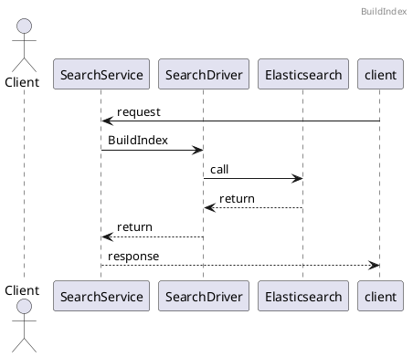

##### 1.2 EntityService
1. CreateEntity
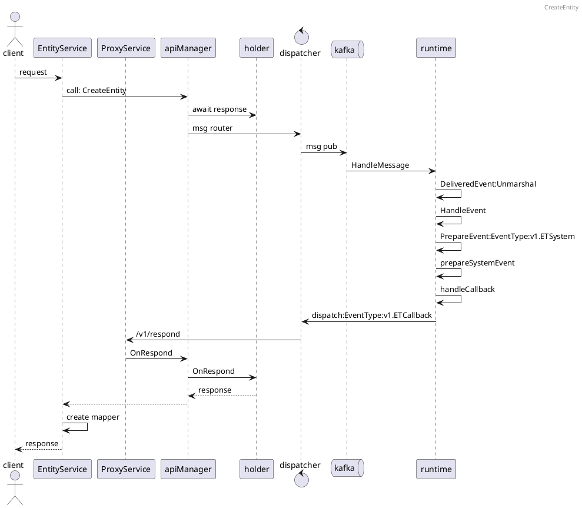
2. UpdateEntity
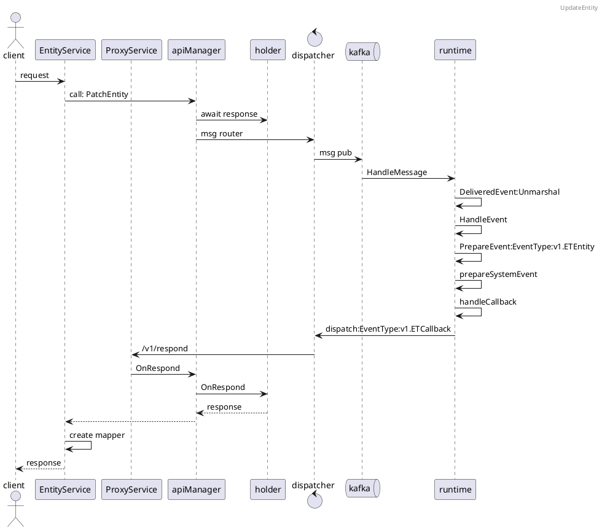
3. GetEntity

4. DeleteEntity
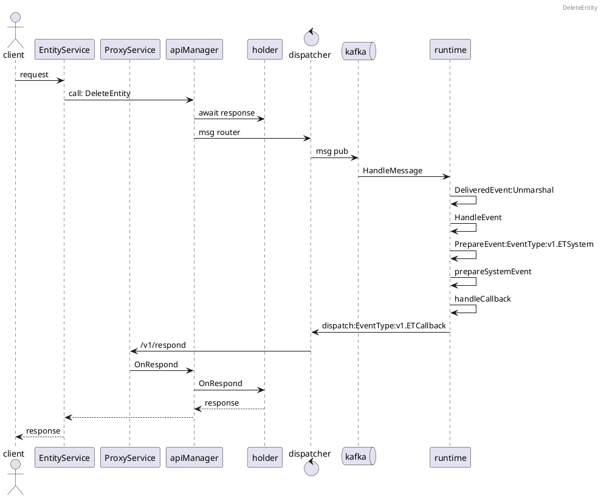
5. UpdateEntityProps
````puml
@startuml

header UpdateEntityProps

actor  client
participant EntityService
participant ProxyService
participant apiManager
participant holder
control dispatcher
queue kafka
participant runtime

client->EntityService:request
EntityService->apiManager:call: PatchEntity
apiManager->holder:await response
apiManager->dispatcher:msg router
dispatcher->kafka:msg pub
kafka->runtime:HandleMessage
runtime->runtime:DeliveredEvent:Unmarshal
runtime->runtime:HandleEvent
runtime->runtime:PrepareEvent:EventType:v1.ETEntity 
runtime->runtime:prepareSystemEvent
runtime->runtime:handleCallback
runtime->dispatcher:dispatch:EventType:v1.ETCallback
dispatcher->ProxyService:/v1/respond
ProxyService->apiManager:OnRespond
apiManager->holder:OnRespond
holder-->apiManager:response
apiManager-->EntityService
EntityService-->client:response

@enduml
````
6. PatchEntityProps
```puml

header PatchEntityProps

actor  client
participant EntityService
participant ProxyService
participant apiManager
participant holder
control dispatcher
queue kafka
participant runtime

client->EntityService:request
EntityService->apiManager:call: PatchEntity
apiManager->holder:await response
apiManager->dispatcher:msg router
dispatcher->kafka:msg pub
kafka->runtime:HandleMessage
runtime->runtime:DeliveredEvent:Unmarshal
runtime->runtime:HandleEvent
runtime->runtime:PrepareEvent:EventType:v1.ETEntity 
runtime->runtime:prepareSystemEvent
runtime->runtime:handleCallback
runtime->dispatcher:dispatch:EventType:v1.ETCallback
dispatcher->ProxyService:/v1/respond
ProxyService->apiManager:OnRespond
apiManager->holder:OnRespond
holder-->apiManager:response
apiManager-->EntityService
EntityService-->client:response

```
7. PatchEntityPropsZ

8. RemoveEntityProps
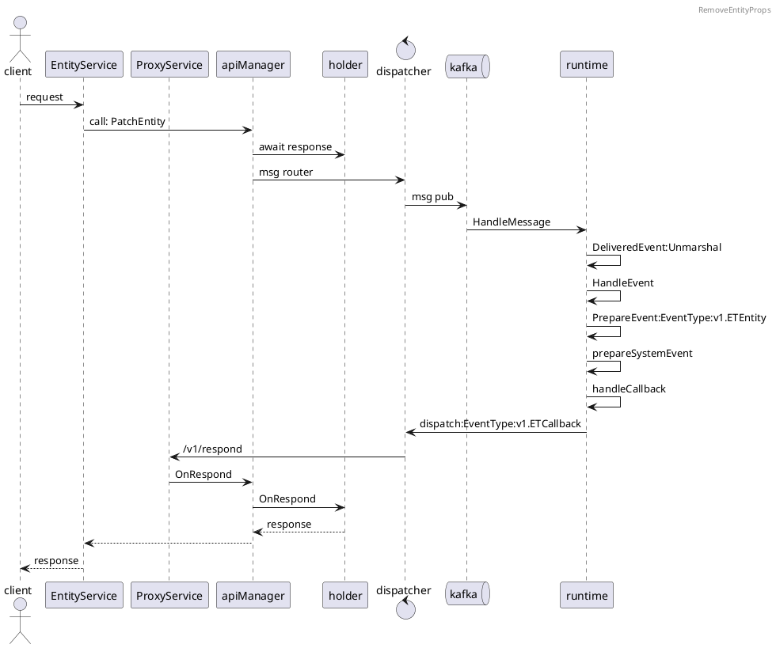
9. UpdateEntityConfigs

10. PatchEntityConfigs

11. GetEntityConfigs

12. RemoveEntityConfigs

13. ListEntity
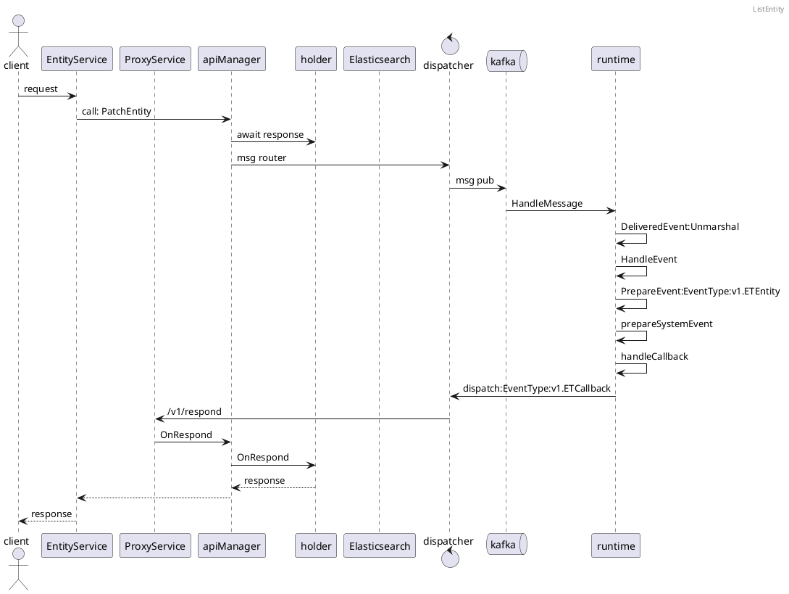
##### 1.3 SubscriptionService
1. CreateSubscription
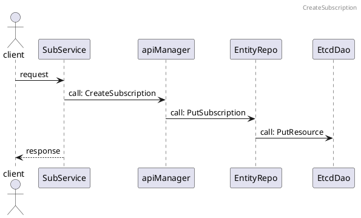
2. UpdateSubscription

3. DeleteSubscription
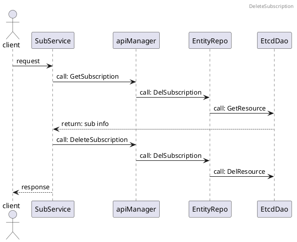
4. GetSubscription
5. ListSubscription

##### 1.4 TopicService
1.TopicEventHandler
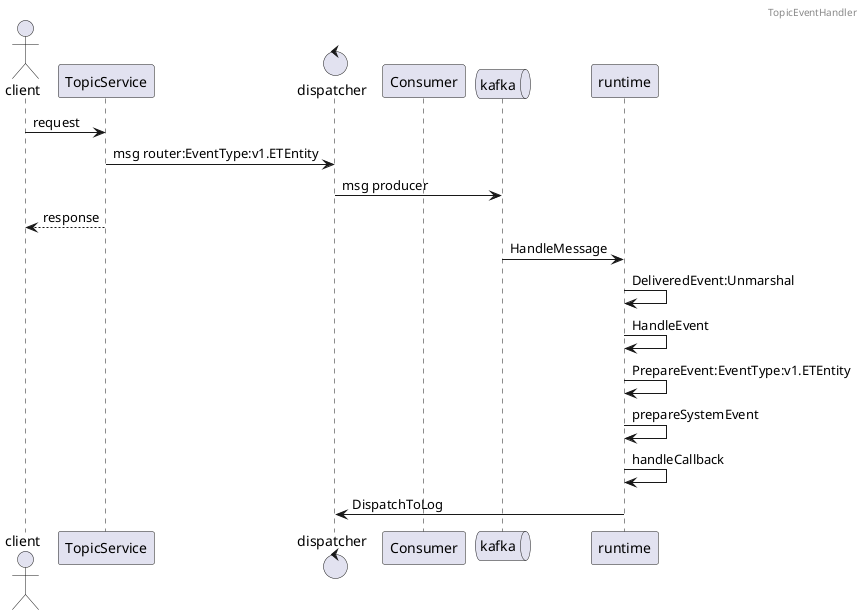
##### 1.5 TsService
1. GetTSData
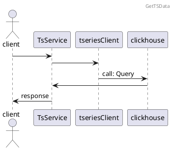
##### 1.7 RawDataService
1. GetRawdata
```puml
@startuml

header GetRawdata

actor client
participant RawDataService
participant tseriesClient
participant  clickhouse

client->TsService
TsService->tseriesClient
tseriesClient->clickhouse:call: Query
clickhouse->TsService
TsService->client:response
@enduml
```
##### 1.8 GOPSService
1. Metrics
2. Debug
3. SetNode
##### 1.9 MetricsService
1. Metrics
