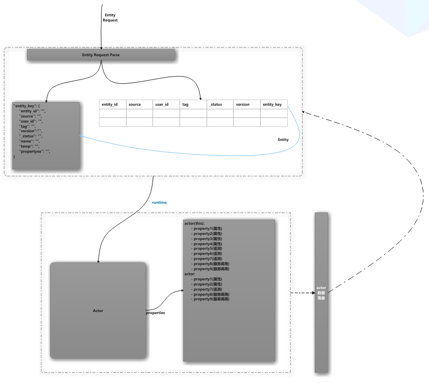

## 实体（Entity）

> 物联网世界里的操作对象，以及这些对象组合抽象出来的对象，包括网关，设备，设备的聚合抽象等等。

## 组成

实体（Entity）由两部分组成：
- 描述实体的 **头部**
- 实体 **属性**

头部字段是 **固定** 且 **必须** 的，属性部分是 *可选* 的，属性部分以 Key-Value 的形式存在，以提供良好的扩展性。

- 实体具有零个或多个属性。
- 实体属性的类型可以是 *任意类型* 。
- 实体 **必须** 有如下字段：
    - **entity_id**: 实体id
    - **tag**： 实体标签
    - **type**: 实体的类型，诸如设备，空间等
    - **user_id**: 实体拥有者
    - **source**： 实体的创建插件
    - **version**： 实体的版本

## 实体的两种存在形式

对于物联网世界中的操作对象的数字化抽象，我们不仅抽象其状态，对其行为的抽象也是非常重要的。物理世界中存在的`对象`，我们知道其类型不同其行为一般是不同的。所以我们为实体创建运行时`Actor`，来对物理世界中`对象`的`状态`和`行为`进行描述。

实体区分转台存储和运行时实体actor，实体状态在actor维护和更新，并采用一定策略落盘。

## 实体状态的存储

实体的存储我们根据对实体操作的需求分为两部分，对于实体的头部信息使用关系型数据库存储，方便索引，对于实体的属性我们采用KV存储，以期满足其足够的扩展性。

