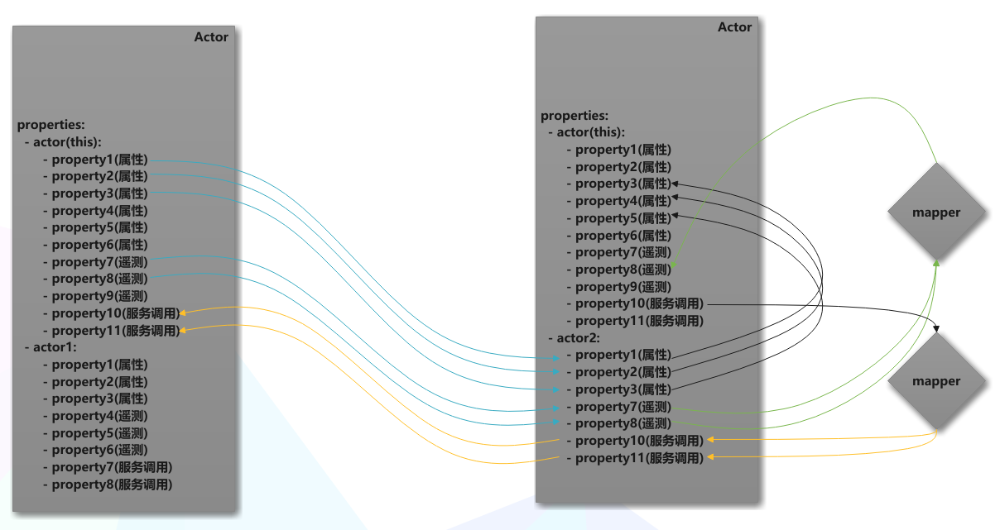
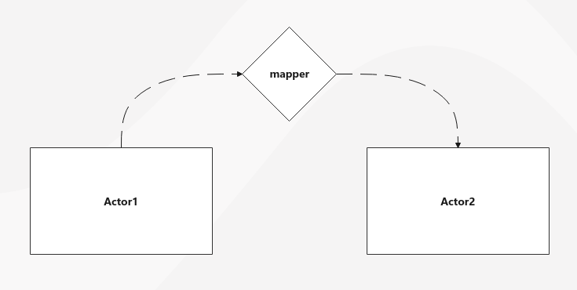
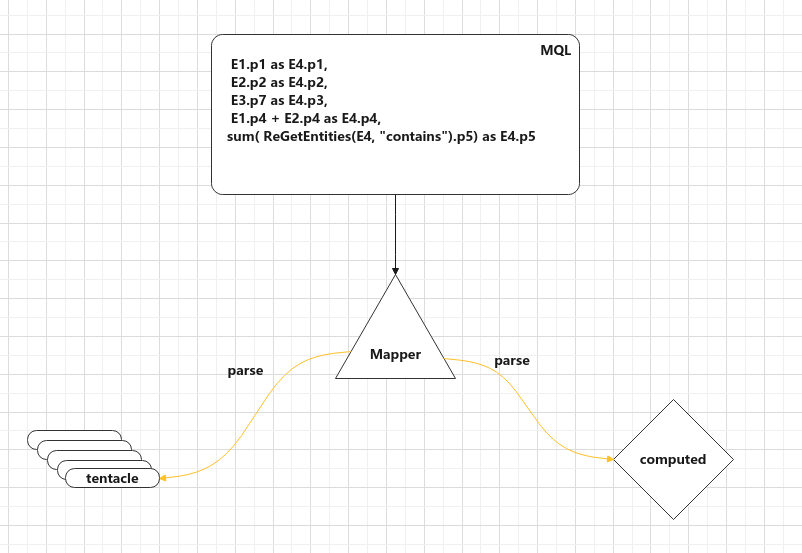
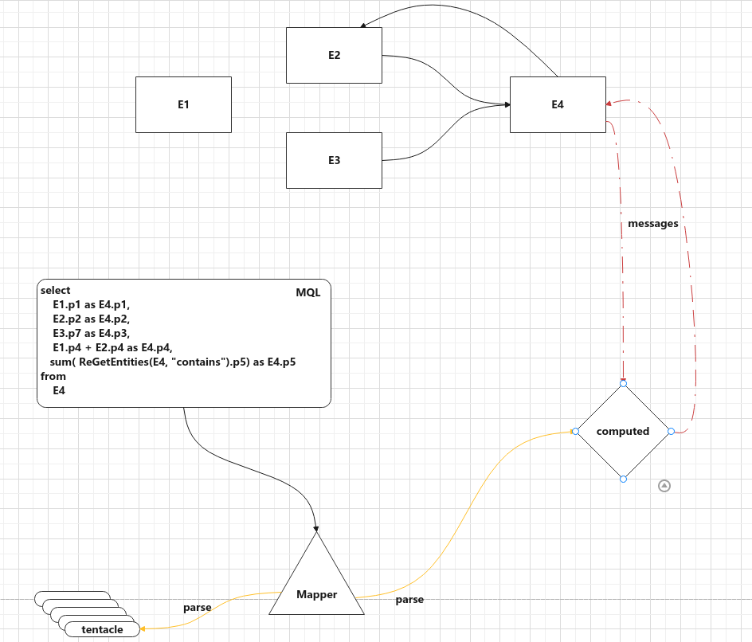
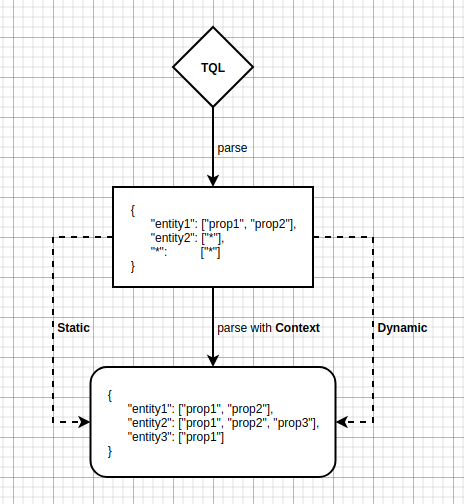
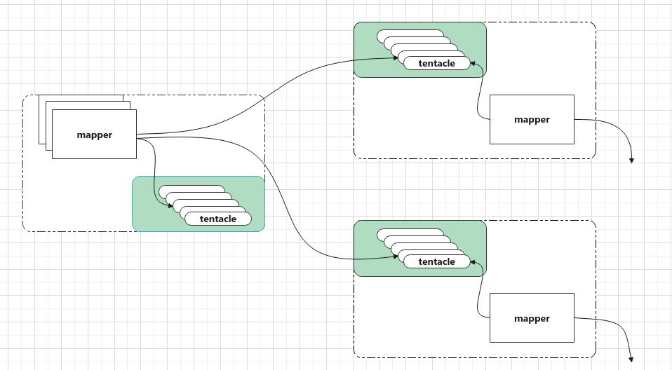
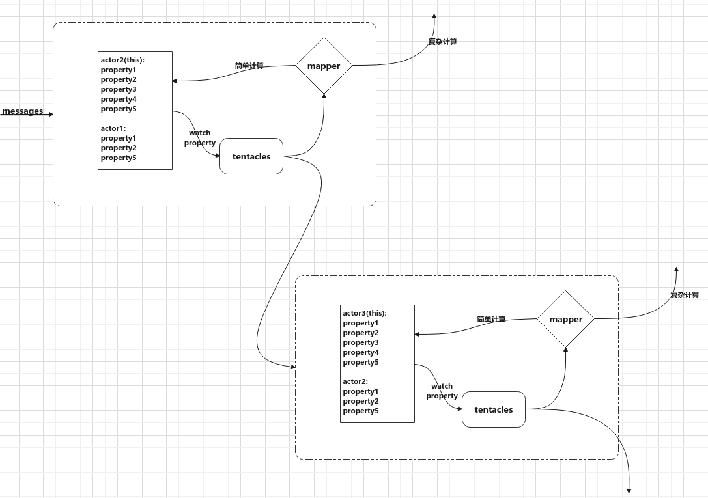

## 简介

`mapper`是对于用于实体与实体之间数据映射的一种对象，`mapper`使用`MQL`描述实体与实体之间的数据映射。

## 映射

映射就是从一个或多个实体中选取部分属性，然后将选取的部分属性经过重组或计算然后更新目标实体的状态。

### 概念

- Actor：实体的运行时，维护实体的状态和提供的操作。
- maper: Actor与Actor之间数据映射的执行实例。
- computed： mapper内的计算模块，通过输入计算输出。
- SourceActor：在映射中提供变更数据的Actor，如图中的Actor1。
- TargetActor：在映射中作为映射目标的Actor，如图中的Actor2。

我们通过对此过程的分析，可将这一过程分为三部分：
1. 写复制传递实体属性的变更。
2. 将属性的变更作为输入计算映射结果。
3. 将映射计算结果更新到Actor。

采用宏观的视角看来，实体与实体之间的数据映射就是从一个或多个`SourceActor`中选取部分属性作为输入，通过重组或计算得到输出，然后将输出更新到`TargetActor`。而我们可以对这一过程进行概括，来自`SourceActor`的输入组成一个`Json`数据，`映射`的输出是一个`Json`，那么此时我们发现我们所做的映射其实就是从`SourceActor`拿到输入`Json`，通过一定的转化`规则`将输入`Json`转化成另一个输出`Json`，然后在将输出的`Json`更新到`TargetActor`。

)

我们通过对此过程的分析，可将这一过程分为三部分：
1. 从一个或多个`SourceActor`中选取部分属性，选取的数据可以构成一个`json`。
2. 以选取的数据作为`mapper`的输入，执行`mapper`并输出一个`json`。
3. 将`mapper`执行的输出作为反馈更新目标实体的状态。

## 解析mapper

我们知道`mapper`执行分为`选取输入`，`计算输出`，`更新目标Actor状态`三个阶段。为了满足这三个阶段，我们给`mapper`引入两个核心概念：`MQL`和`tentacle`，`MQL`是`mapper`的核心组件用于描述映射中json的转化规则，执行计算。`tentacle`译为`触手`，用于映射第一阶段中的属性变更的同步。

<!--  -->

### 解析 Tentacle

对于 `Tentacle` 在定义`TQL` 的时候我们有时候就能够指代清楚我们定义的选取的实体或属性，我们可能需要通过结合服务节点的上下文计算解析才能得到结论。

在结合服务节点上下文解析的时候，我们分为动态和静态两种方式。

## tentacle 分发

## mapper & tentacle 数据流向

mapper通过解析`MQL`生成`tentacle`，`mapper`为每一个`SourceActor`生成一个`tentacle`用于同步属性变更。

## Issues

在我们设计的系统中，实体与实体之间的数据是可以相互传递的，对于上行数据而言，是对真实状态的扩散和传递，但是对于下行的调用数据，其实一个期望值向下传递的过程，是否需要Ack，需要desired？ 同事实体的调用属性是否会处于`占用`状态？

