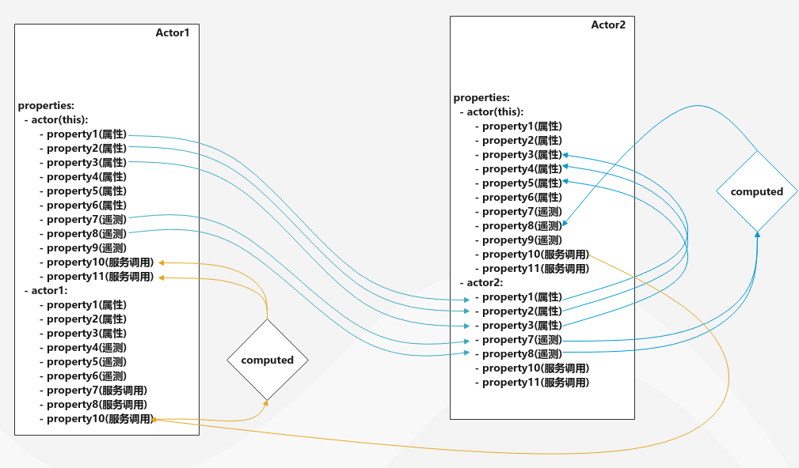

## 简介

`Mapper`是对于用于实体与实体之间数据映射的一种对象，`Mapper`使用`MQL`描述实体与实体之间的数据映射。

## 映射

映射就是从一个或多个实体中选取部分属性，然后将选取的部分属性经过重组或计算然后更新目标实体的状态。

我们通过对此过程的分析，可将这一过程分为三部分：
1. 从一个或多个实体中选取部分属性，选取的数据可以构成一个`json`。
2. 以选取的数据作为`Mapper`的输入，执行`Mapper`并输出一个`json`。
3. 将`Mapper`执行的输出作为反馈更新目标实体的状态。

## 解析Mapper

## Mapper & Tentacles

## Mapper数据流向

1. 浅绿色块和虚线范围都表示一个Entity，之所以如此在于解释Entity内部mapper和tentacle的关系。
2. 绿色粗线表示Entity为mapper映射提供输入。
3. 色粗线表示mapper对Entity的输出。
4. 图上可知，mapper为与之相关的所有Entity提供一个tentacle，mapper所在Entity也是如此，mapper的输入从mapper所在的Entity获取， 其他Entity通过Tentacle将数据复制到mapper所在Entity。
5. 一个Entity可以拥有多个mapper。

