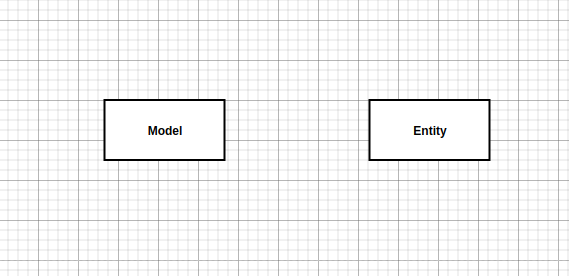

## Model


> model 作为实体存在， model 是对 Entity 的约束定义，模型和实体之间可以存在继承关系从而建立约束力。

## Roadmap

1. 模型实体
2. 模型是实体属性约束的定义。
3. 模型和实体之间定义`继承`关系实现约束力。
4. 模型支持本地化，实体的约束条件可以在模型的基础上特化。
5. 实体可以不继承任何模型。


## 模型是特定类型的实体

模型是具有特定类型的实体，和`设备`，`空间`，`订阅`一样都是实体。




## 模型和实体之间的关系

模型和实体之间可以存在`继承` `关系`，通过`继承`来完成模型对实体的约束。


## 模型允许多继承

同一个实体的约束条件可能是来自多个模型，我们对这些模型约束进行合并，合并的结果作为实体的约束条件。


## 模型约束允许本地化

为了满足实体特定的约束，我们允许实体在继承模型的基础上定义本地化约束。


`本地化约束`其实和模型的继承关系是统一的，`本地化约束`就像是实体本地的一个模型，只能被当前实体继承。


## 模型实现

模型是实体，模型也具有属性，是k-v的，模型的属性用于描述继承该模型的属性的约束条件。


```go 
type Constraint struct {
    Type string 
    LastTime int64
    Weight int
    Defines []Define
}


type Define interface {
    Viod()
}

type Bound struct {
    // ...
}

func (b Bound) Void() {}


type ChangeDelta struct {
    // percentage or Abs.
    Type string 
    Delta float
}

func (cd ChangeDelta) Void() {}

// ..........

```