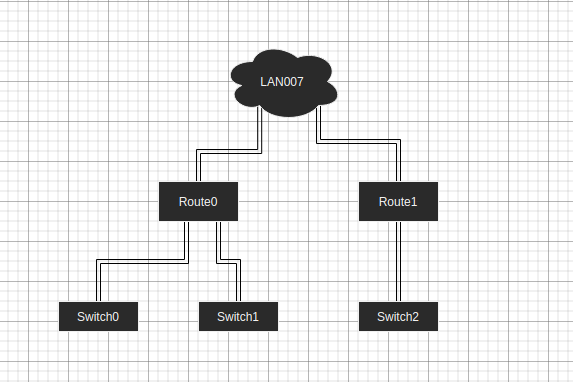

## Relationship

在物理世界中，实体与实体之间往往不是相互孤立的，它们之间往往存在各式各样的联系，如交换机，路由器，终端设备，服务器通过光纤连接，在网络拓扑图中这些设备实体有`连接关系`。这些关系将这些独立的设备实体链接在一起，组成复杂而精密的网络，向外提供稳定而高速的网络通信服务。关系的核心在于有效的组织独立的实体，使得他们能够组成一个功能齐全的集合，以集合为单位向外提供丰富多彩的功能。

就现实意义而言，如果你仅仅有交换机，路由器，而没有将他们连接，那么他们是无法构建和提供高吞吐低延迟的网络系统的；再者，如果现在我们有一个智慧园区的场景，我们首先应该需要清楚的是我们需要构建那些类型的实体来映射物理园区中的设备和空间，其次我们需要将这些构建的实体串联起来，来构建一个数字化的园区，从实体到园区，这即是关系的意义。

其次，对于园区项目我们是可以模板化的，我们可以为园区中的部分结构刻录模板，如楼宇，楼层，运动场，游泳池，他们都不是单个或者单类型的实体，而是一些实体的有效组合，而这种组合方式，依赖于关系。